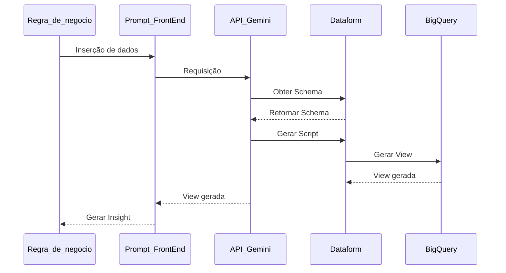

## Automatização de Views com IA Baseada em Regras de Negócio

## Objetivo

Implementar uma solução automatizada, utilizando o modelo de IA Gemini integrado ao Google Cloud Platform (GCP), para gerar views a partir de regras de negócio definidas. O sistema deve interpretar essas regras e criar automaticamente as views no dataform, otimizando processos, aumentando a precisão e a escalabilidade, e proporcionando flexibilidade para a equipe de desenvolvimento e análise de dados.

## Tecnologias
- Python 3.12
- VertexAI API - (gemini-1.5-flash-001)
- Google Cloud BigQuery 
- DataForm
    

## Fluxo

Este diagrama descreve o fluxo de trabalho que seguimos para automatizar a criação de views utilizando a API Gemini e BigQuery. O processo começa quando inserimos os dados no front-end, que faz a requisição para a API Gemini. A API, então, consulta o Dataform para obter o schema necessário. Com esse schema, a API gera o script para criação da view, e o envia ao Dataform, que cria a view diretamente no BigQuery. Após a view ser gerada, o BigQuery confirma o sucesso da operação e a informação retorna ao front-end. A partir daí, podemos usar a view criada para gerar insights que atendem às nossas necessidades de negócio.

---

## Resultado

Nessa última sprint, conseguimos desenvolver um programa que nos permitia receber um requisito de negócio através de um input. Com esse requisito, definimos uma instrução que levaria a Inteligência Artificial (Gemini-flash) a gerar uma consulta em SQL baseando-se na estrutura da tabela especificada. Com essa consulta, pudemos coletar os dados da tabela e apresentar à IA Generativa junto de uma instrução que a orientaria a gerar um insight com base nos dados consultados.